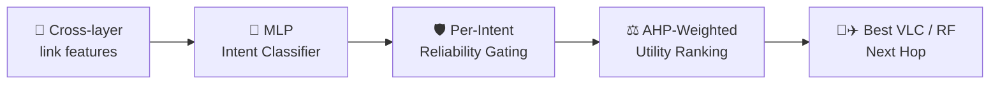

<!-- ===================== HEADER ===================== -->
<p align="center">
  
</p>

<p align="center">
  <a href="https://git.io/typing-svg">
    
  </a>
</p>

<p align="center">
  <a href="https://linkedin.com/in/mohitkumarthakur/"></a>
  <a href="YOUR_PORTFOLIO_URL"></a>
  <a href="mailto:mohitiit2005@gmail.com"></a>
  <a href="https://leetcode.com/YOUR_LEETCODE_USERNAME"></a>
  
</p>

---

## 👨‍💻 About Me

```python
class Mohit:
    def __init__(self):
        self.role      = "B.Tech ECE @ Faculty of Technology, University of Delhi"
        self.minor     = "AI & Machine Learning"
        self.research  = "Intent-aware routing for hybrid VLC/RF VANET-FANET networks"
        self.building  = ["Agentic AI", "RAG pipelines", "Full-stack ML apps"]
        self.exploring = ["LangGraph", "Quantum ML"]
        self.fun_fact  = "I optimise network routes and LeetCode runtimes 🚀"

    def say_hi(self):
        print("Thanks for dropping by — let's build something cool!")
```

- 🛰️ **Research Intern @ IIIT Delhi** — Hybrid VLC/RF Vehicular & Aerial Networks
- 🧠 Turning ML research into **reproducible, open-source** systems
- ⚡ Shipping **FastAPI + React** apps backed by ML and LLMs
- 🏆 **1st place — Astraaya 1.0** hackathon with *ResQRoute*

---

## 🛠️ Tech Stack

<p align="center">
  <b>Languages</b><br/><br/>
  
</p>

<p align="center">
  <b>Frameworks & Libraries</b><br/><br/>
  <br/><br/>
  
  
  
</p>

<p align="center">
  <b>Cloud & Databases</b><br/><br/>
  
</p>

<p align="center">
  <b>Developer Tools</b><br/><br/>
  <br/><br/>
  
  
</p>

<details>
<summary><b>🤖 AI/ML & GenAI — click to expand</b></summary>
<br/>

| Area | Topics |
|---|---|
| **GenAI** | RAG · Agentic AI · Prompt Engineering · GenAI |
| **Core ML** | Neural Networks · NLP · Reinforcement Learning |
| **Exploring** | Quantum ML 🔬 |
| **CS Fundamentals** | OOP · Operating Systems · Data Structures & Algorithms |

</details>

---

## 🔬 Research Work

<details open>
<summary><b>🛰️ Hierarchical Intent-Aware Routing for Hybrid VLC/RF VANET-FANET Networks</b> &nbsp;·&nbsp; 2026</summary>
<br/>

A three-stage cascaded pipeline that decides *what the traffic needs* before deciding *where it goes*:



- AHP weights built from **Saaty pairwise matrices** with consistency-ratio verification
- Benchmarked against **AODV / DSDV** across three congestion regimes
- Full reproducibility package open-sourced

`Python` `scikit-learn` `MATLAB` `AHP` &nbsp;→&nbsp; [**View Repo**](https://github.com/Mohit-Kumar-Thakur)
</details>

<details>
<summary><b>🚦 ML-Driven Utility-Based Hybrid VLC-RF Routing for Congestion-Aware UAV-Assisted VANETs</b> &nbsp;·&nbsp; 2026</summary>
<br/>

- **350-tree Random Forest** on 7 cross-layer features over **20,000 samples**
- 6-criteria multi-objective utility function for route selection

| Metric (vs AODV) | Improvement |
|---|---|
| 📉 Congestion index | **up to 62.3% ↓** |
| ⏱️ End-to-end delay | **59.5% ↓** |

`Python` `MATLAB` `scikit-learn` &nbsp;→&nbsp; [**View Repo**](https://github.com/Mohit-Kumar-Thakur)
</details>

---

## 🚀 Featured Projects

<table>
<tr>
<td width="50%" valign="top">

### 🤖 AI Research Agent
Full-stack research assistant — FastAPI hands queries to a **Celery/Redis** worker that web-searches and summarises with a **Groq LLM**, returning sourced reports to a React 18 dashboard behind JWT auth. Also prototyped RAG/agent modules (ChromaDB, ReAct loop).

`FastAPI` `Celery` `Redis` `PostgreSQL` `React`

[🌐 Live Demo](YOUR_LIVE_DEMO_URL) · [💻 Code](https://github.com/Mohit-Kumar-Thakur)

</td>
<td width="50%" valign="top">

### 🌦️ Weather Data Pipeline + ML
Ingests Open-Meteo data into PostgreSQL (**8,900+ records**), engineers 18 features, and compares LR / RF / XGBoost — best model hits **R² = 0.9975**, served through a FastAPI REST API on Render.

`Python` `PostgreSQL` `XGBoost` `FastAPI`

[🌐 Live Demo](YOUR_LIVE_DEMO_URL) · [💻 Code](https://github.com/Mohit-Kumar-Thakur)

</td>
</tr>
<tr>
<td width="50%" valign="top">

### 🏫 DevNest
Campus communication & opportunity platform — auth, opportunity dashboard, learning module and moderated community, with JWT/Google OAuth, real-time **Socket.IO** and a CRON scraper for Unstop/Devpost listings.

`React` `TypeScript` `Node.js` `MongoDB`

[💻 Code](https://github.com/Mohit-Kumar-Thakur)

</td>
<td width="50%" valign="top">

### 🩺 MediGenie
AI health companion predicting disease risk across **8 disease datasets** with Random Forest; SMOTE + GridSearchCV improved accuracy by **~15%** over baseline.

`React` `FastAPI` `Express` `scikit-learn`

[💻 Code](https://github.com/Mohit-Kumar-Thakur)

</td>
</tr>
</table>

---

## 🏆 Achievements

| | |
|---|---|
| 🥇 | **Hackathon Winner — Astraaya 1.0** · Built *ResQRoute*, an emergency-vehicle coordination platform |
| 💻 | **GeeksforGeeks** Institute Rank **#4** (FoT, DU) · **LeetCode** Contest Rating **1499** |
| ☁️ | **NPTEL** — Cloud Computing |
| 📊 | **Deloitte Forage** — Data Analytics, Technology, Cyber Security simulations |

---

## 📊 GitHub Analytics

<p align="center">
  
  
</p>

<p align="center">
  
</p>

<p align="center">
  
</p>

<details>
<summary><b>🏅 GitHub Trophies</b></summary>
<br/>
<p align="center">
  
</p>
</details>

---

## 🐍 Contribution Snake

<p align="center">
  <picture>
    <source media="(prefers-color-scheme: dark)" srcset="https://raw.githubusercontent.com/Mohit-Kumar-Thakur/Mohit-Kumar-Thakur/output/github-snake-dark.svg" />
    
  </picture>
</p>

---

<p align="center">
  
</p>


